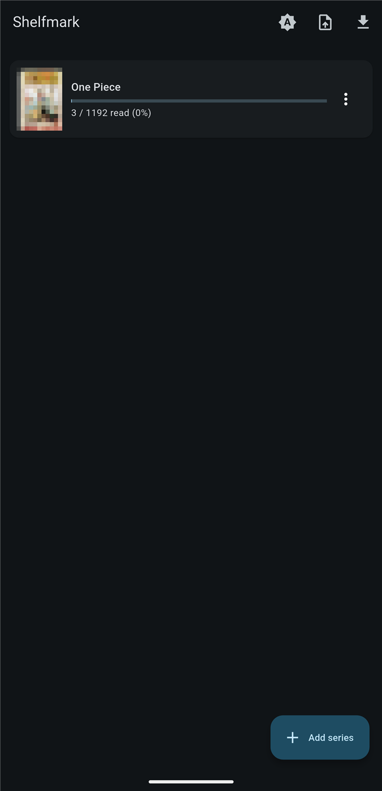
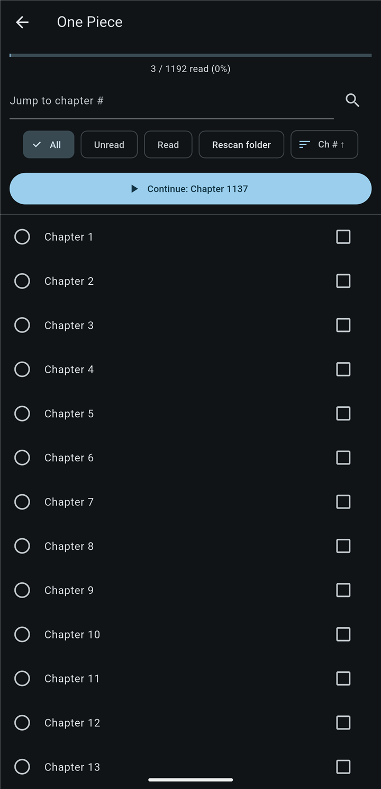
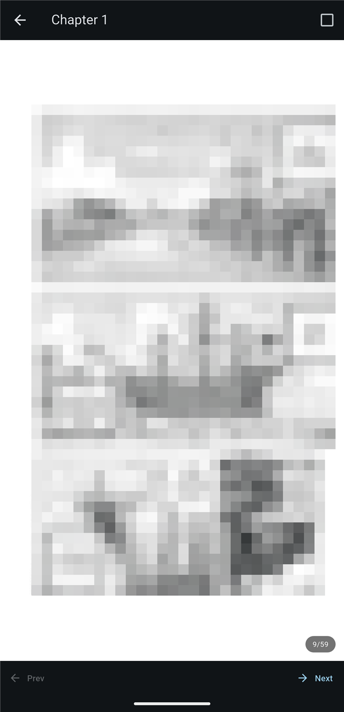

<p align="center">
  
</p>

<h1 align="center">Shelfmark</h1>

<p align="center">
  A Flutter app for tracking reading progress across folders of chapter PDFs.<br>
  Offline, no accounts, and all your data stays on the device.
</p>

<p align="center">
  <a href="https://github.com/prtkgrg/shelfmark/releases/latest"></a>
  <a href="https://github.com/prtkgrg/shelfmark/actions/workflows/ci.yml"></a>
  
  
</p>

---

Long series often come as hundreds of PDFs, one per chapter. PDF readers remember
where you are inside a file, but not where you are across a folder. Shelfmark
keeps a library of those folders and remembers, for each series, which chapters
you've read and the page you stopped on.

<p align="center">
  
  
  
</p>
<p align="center"><sub>Library, chapter list and reader. Artwork is pixelated.</sub></p>

## Features

- **Library of series:** point it at any folder of chapter PDFs. Each series keeps its own progress, and you can drag to reorder the grid.
- **Resume mid-chapter:** reopening a chapter returns to the exact page you left.
- **Chapter list:** filter by all, unread or read; sort by chapter number or recently read; jump to a chapter.
- **Auto-generated covers** rendered from the first page of each series.
- **Reading streak and weekly stats** on the library screen.
- **Home-screen widget** showing what you're reading. Tap it to continue.
- **Release tracking:** link a series to MangaDex's official API or any web page. Shelfmark shows an "N new" badge and sends a notification when new chapters come out.
- **Backup and restore** of every series and all progress to a single JSON file.
- **Light, dark and system themes.**

## Design decisions

The app is small, about 2,000 lines of Dart, but a few choices keep it reliable.

**Chapters are derived, never stored.** Each time you open a series, Shelfmark
scans its folder and reads chapter numbers from filenames with a tolerant regex.
It matches `Chapter 691`, `chapter_1186_[extra]` and similar names. Because there's
no chapter database, there's nothing to fall out of sync: add PDFs, rescan, done.

**Loading must never throw.** Progress is saved as JSON maps. Backups can be
hand-edited or come from an older version, so parsing drops malformed entries
instead of failing. Importing a backup takes two passes: the first parses the file
and checks for conflicts without touching storage, the app then asks you to confirm
the overwrite, and only then does the second pass write anything.

**Covers are cached against their source.** Each cached cover has a marker file
recording which chapter and file it was rendered from. If a rescan changes the
earliest chapter, the cover regenerates; otherwise the cache is reused. If
rendering fails, the old cover is shown rather than an empty tile.

**Network code fails quietly.** Release sources sit behind a `ReleaseSource`
interface. Any failure returns `null` and keeps the last known number, so being
offline never breaks the library. Parsing is kept in pure functions, which makes
it unit-testable. Notifications fire only when the latest chapter number *grew
since the last check*, so the same news doesn't re-alert on every launch.

**Deliberate scope limit.** Shelfmark only tracks and notifies. It never
downloads chapters, which keeps it out of the business of fetching copyrighted
content.

```
lib/
├── main.dart                 app entry, theme bootstrap
├── library_screen.dart       series grid        ─┐
├── series_screen.dart        chapter list        ├─ library → series → reader
├── reader_screen.dart        PDF reader         ─┘
├── models/                   Series, Chapter
├── library_store.dart        ordered series list        (SharedPreferences)
├── progress_store.dart       per-series read / page state (SharedPreferences)
├── chapter_scanner.dart      folder → chapters
├── thumbnail.dart            cover rendering + cache
├── release_source.dart       MangaDex API / web-page sources
├── release_tracker.dart      refresh + notify
├── widget_service.dart       home-screen widget bridge
├── backup.dart               JSON export / two-pass import
└── stats.dart                streak + weekly counts
```

## Tech

Flutter · Dart · `shared_preferences` · `flutter_pdfview` (reader) · `pdfx`
(off-screen cover rendering) · `home_widget` with a native Kotlin widget provider ·
`flutter_local_notifications` · GitHub Actions for tests and signed release APKs.

## Install

Download the APK from the [latest release](https://github.com/prtkgrg/shelfmark/releases/latest)
and install it on Android 10 or later. Tap **Add series**, pick a folder, and
allow file access when asked. The app needs access to all files because your PDFs
live outside its private storage.

## Build and test

```bash
flutter pub get
flutter analyze
flutter test
flutter build apk --release
```

Tests cover the chapter-filename scanner, streak and weekly stats, and release
source parsing. CI runs `analyze` and `test` on every push and pull request.
Pushing a `v*.*.*` tag builds a signed APK and publishes a GitHub release.

## Author

Built in my own time by [Prateek Garg](https://prateekgarg.dev), a lead engineer
working on Java and Flutter.
